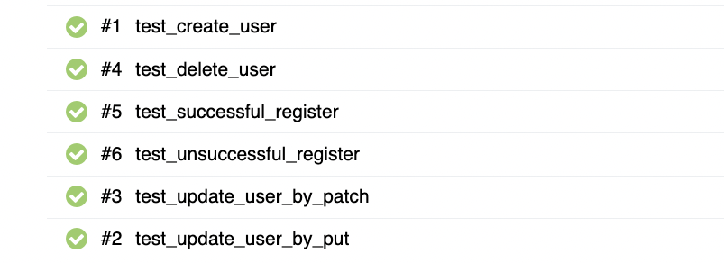
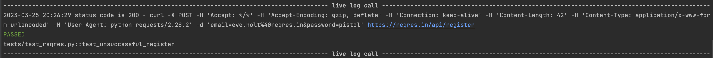
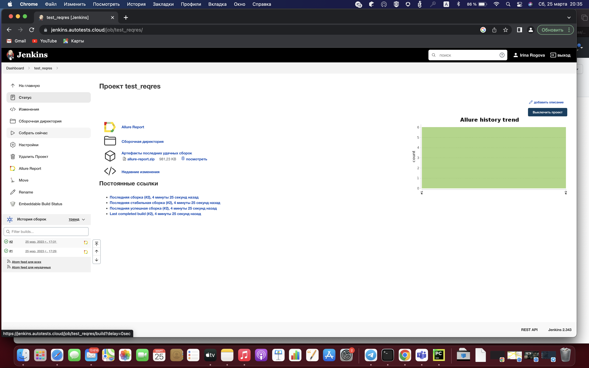
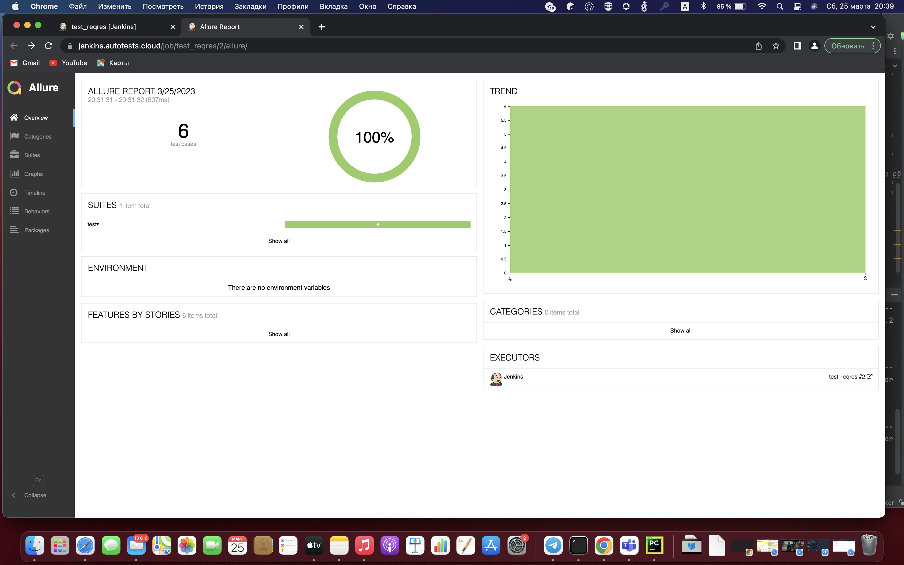
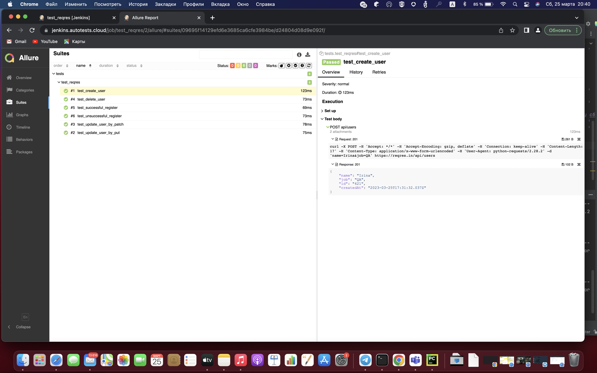

## Проект API автотестов reqres.in

<!-- Технологии -->

### Используемые технологии
<p  align="center">
  <code></code>
  <code></code>
  <code></code>
  <code></code>
  <code></code>
  <code></code>
  <code></code>
  <code></code>
</p>

### Что выполняет тест:



## :computer: Запуск тестов из терминала
```bash
pytest tests/test_reqres.py --env=prod
```

В проекте используется встроенный logger - logging:


<!-- Jenkins -->

###  Запуск проекта в Jenkins

### [Job](https://jenkins.autotests.cloud/job/test_reqres/)

##### При нажатии на "Собрать сейчас" начнется сборка тестов и их прохождение


<!-- Allure report -->

###  Allure report

##### После прохождения тестов, результаты автоматически сохраняются. Чтобы посмотреть Allure отчет нужно нажать на иконке allure report у сборки.


##### Во вкладке Suites находятся подробные данные о прохождении теста с приложенными логами

